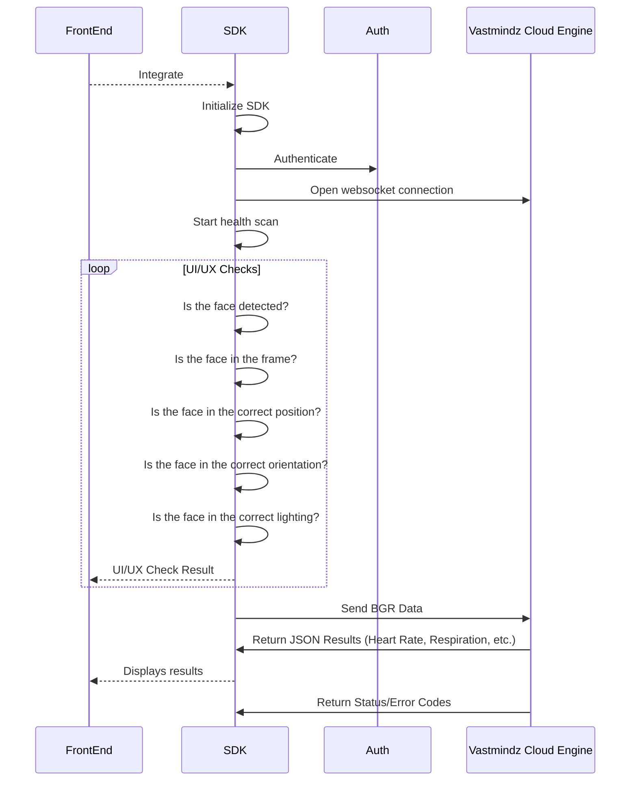

<!-- Improved compatibility of back to top link: See: https://github.com/othneildrew/Best-README-Template/pull/73 -->
<a name="readme-top"></a>
<!--
*** Thanks for checking out the Best-README-Template. If you have a suggestion
*** that would make this better, please fork the repo and create a pull request
*** or simply open an issue with the tag "enhancement".
*** Don't forget to give the project a star!
*** Thanks again! Now go create something AMAZING! :D
-->


<!-- PROJECT SHIELDS -->
<!--
*** I'm using markdown "reference style" links for readability.
*** Reference links are enclosed in brackets [ ] instead of parentheses ( ).
*** See the bottom of this document for the declaration of the reference variables
*** for contributors-url, forks-url, etc. This is an optional, concise syntax you may use.
*** https://www.markdownguide.org/basic-syntax/#reference-style-links
-->
<!-- [![Contributors][contributors-shield]][contributors-url]
[![Forks][forks-shield]][forks-url]
[![Stargazers][stars-shield]][stars-url]
[![Issues][issues-shield]][issues-url]
[![MIT License][license-shield]][license-url] -->
[![LinkedIn][linkedin-shield]][linkedin-url]


<!-- PROJECT LOGO -->
<br />
<div align="center">
  <a href="https://github.com/github_username/repo_name">
    
  </a>

<h3 align="center">Web SDK</h3>

  <p align="center">
    This repo contatins all the necessary information for developers to integrate Vastmindz's remote health screening solution into a web-based application
    <br />
    <a href="https://github.com/Vastmindz-Public-Repository/Web-SDK"><strong>Explore the docs »</strong></a>
    <br />
    <br />
    <a href="https://tmp.gevg.xyz/capture">View Demo</a>

  </p>
</div>


<!-- ABOUT THE PROJECT -->
## About The Project

<!-- [![Product Name Screen Shot][product-screenshot]](https://example.com) -->

***High Level Overview***
The below diagram is a detailed overview of the interation between the Vastmindz platform and the front-end application.



<p align="right">(<a href="#readme-top">back to top</a>)</p>

### Built With
* [![Angular][Angular.io]][Angular-url]
* [![React.js][React.js]][React-url]

<p align="right">(<a href="#readme-top">back to top</a>)</p>


<!-- GETTING STARTED -->
## Getting started
---
**NOTE**

You MUST obtain access to our production environment to get started. If you are unsure on how to do this, please reach out to your Vastmindz representative or email us at team@vastmindz.com.

---
To run a quick demo of our web SDK on AngularJS, run the following CLI commands:
```
$ npm install
$ npm run example:angular
```

To run a quick demo of our server web SDK on React, run the following CLI commands:
```
$ npm install
$ npm run example:react-socket
```
**NOTE**

You should have the ssh access to the web SDK repo so that the npm package can be installed correctly


To run a quick demo of our web SDK on native js, run the following CLI commands:
```
$ npm install
$ npm run example:browser
```

## Installation

yarn
```
$ yarn add https://github.com/Vastmindz-Public-Repository/Web-SDK
```

npm
```
$ npm install https://github.com/Vastmindz-Public-Repository/Web-SDK
```

cdn (```rppg``` will be available as global in Browsers)
```
<script src="https://websdk1.blob.core.windows.net/sdk-1-2-3/dist/rppg.min.js"></script>
```

<!-- # Vastmindz's Web SDK

Welcome to Vastmindz's web SDK repository!

[Documentation](https://websdk1.blob.core.windows.net/sdk-1-2-3/docs/index.html)

[Documentation RPPG class](https://websdk1.blob.core.windows.net/sdk-1-2-3/docs/RPPG.html)

[Live demo](https://websdk1.blob.core.windows.net/sdk-1-2-3/example/index.html)

[Source code of examples](https://github.com/Vastmindz-Public-Repository/Web-SDK/tree/master/src/example) -->


<!-- USAGE EXAMPLES -->
## Usage

Use this space to show useful examples of how a project can be used. Additional screenshots, code examples and demos work well in this space. You may also link to more resources.

_For more examples, please refer to the [Documentation](https://example.com)_

<p align="right">(<a href="#readme-top">back to top</a>)</p>

```javascript
import RPPG from './dist/lib/RPPG'
...
const rppgInstance = new RPPG({
  serverless: false,
  onFrame: (data) => {
    console.log('frame data:', data)
    // will print frame data:
    // {
    //   averageFps,
    //   instantFps,
    //   rppgTrackerData,
    //   timestamp
    // }

    console.log('face coordinates data:', data.face)
    // will print array of face data:
    // [x, y, width, height]
  },

  onMeasurementMeanData: (data) => {
    console.log('MeasurementMeanData:', data)
    // will print MeasurementMeanData:
    // {
    //   "bpm": 74,
    //   "rr": 154,
    //   "oxygen": 99,
    //   "stressStatus": "NORMAL",
    //   "bloodPressureStatus": "NORMAL"
    // }
  }

  onMeasurementProgress: (data) => {
    console.log('MeasurementProgress:', data)
    // will print MeasurementProgress data:
    // {
    //   "progressPercent": 55,
    // }
  }
})
await rppgInstance.initCamera({
  width: 640,
  height: 480,
  videoElement: document.querySelector('video'),
  canvasElement: document.querySelector('canvas'),
  onSuccess: ({
    width,
    height,
  }) => {
    console.log('obtained values of width and height', width, height)
  },
})
await rppgInstance.initTracker()
await rppgInstance.initSocket({
  authToken: this.authToken,
})
rppgInstance.start()
...
```


## Build

#### Cloning repository:

```
$ git clone https://github.com/Vastmindz-Public-Repository/Web-SDK
$ cd Web-SDK
```

#### Install dependencies
```
$ npm install
```

#### Build for usage with module structure

```
$ npm run build
```

Here's an example of some Javscript code:
```javascript
import RPPG from 'dist/RPPG'
const rppgInstance = new RPPG({
  config
})
```

#### Build for usage with browser script

```
$ npm run build:browser
```

Here's an example of some HTML code:
```html
<script src="dist/rppg.min.js">
<script>
const rppgInstance = new rppg({
  config
})
</script>
```

#### Build documentation

```
$ npm run build:doc
```

## Note
The sdk is based on the WebAssembly standard; therefore, on first use, it needs some time to download and compile the wasm and data files. After the first use, the browser may cache the file so that the next time no 'downloading' is required.

<!-- CONTACT -->
## Contact

- Twitter: [@vastmindz](https://twitter.com/vastmindz)
- Email: team@vastmindz.com

<p align="right">(<a href="#readme-top">back to top</a>)</p>

<!-- MARKDOWN LINKS & IMAGES -->
<!-- https://www.markdownguide.org/basic-syntax/#reference-style-links -->
[contributors-shield]: https://img.shields.io/github/contributors/github_username/repo_name.svg?style=for-the-badge
[contributors-url]: https://github.com/github_username/repo_name/graphs/contributors
[forks-shield]: https://img.shields.io/github/forks/github_username/repo_name.svg?style=for-the-badge
[forks-url]: https://github.com/github_username/repo_name/network/members
[stars-shield]: https://img.shields.io/github/stars/github_username/repo_name.svg?style=for-the-badge
[stars-url]: https://github.com/github_username/repo_name/stargazers
[issues-shield]: https://img.shields.io/github/issues/github_username/repo_name.svg?style=for-the-badge
[issues-url]: https://github.com/github_username/repo_name/issues
[license-shield]: https://img.shields.io/github/license/github_username/repo_name.svg?style=for-the-badge
[license-url]: https://github.com/Vastmindz-Public-Repository/Web-SDK/blob/master/LICENSE.txt
[linkedin-shield]: https://img.shields.io/badge/-LinkedIn-black.svg?style=for-the-badge&logo=linkedin&colorB=555
[linkedin-url]: https://www.linkedin.com/company/28917477/admin/
[product-screenshot]: images/screenshot.png
[Next.js]: https://img.shields.io/badge/next.js-000000?style=for-the-badge&logo=nextdotjs&logoColor=white
[Next-url]: https://nextjs.org/
[React.js]: https://img.shields.io/badge/React-20232A?style=for-the-badge&logo=react&logoColor=61DAFB
[React-url]: https://reactjs.org/
[Vue.js]: https://img.shields.io/badge/Vue.js-35495E?style=for-the-badge&logo=vuedotjs&logoColor=4FC08D
[Vue-url]: https://vuejs.org/
[Angular.io]: https://img.shields.io/badge/Angular-DD0031?style=for-the-badge&logo=angular&logoColor=white
[Angular-url]: https://angular.io/
[Svelte.dev]: https://img.shields.io/badge/Svelte-4A4A55?style=for-the-badge&logo=svelte&logoColor=FF3E00
[Svelte-url]: https://svelte.dev/
[Laravel.com]: https://img.shields.io/badge/Laravel-FF2D20?style=for-the-badge&logo=laravel&logoColor=white
[Laravel-url]: https://laravel.com
[Bootstrap.com]: https://img.shields.io/badge/Bootstrap-563D7C?style=for-the-badge&logo=bootstrap&logoColor=white
[Bootstrap-url]: https://getbootstrap.com
[JQuery.com]: https://img.shields.io/badge/jQuery-0769AD?style=for-the-badge&logo=jquery&logoColor=white
[JQuery-url]: https://jquery.com 

